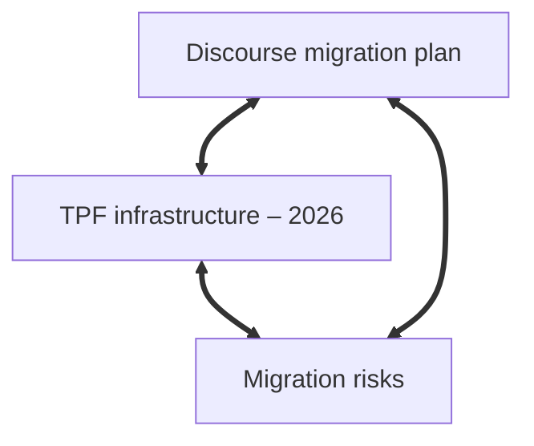

For years I kept my notes in a single directory of Markdown files, edited entirely in VS Code. It was a functional system: simple, resilient, and editable in the same application I used for coding and writing. But it had one defect: it couldn’t keep pace with my thinking. My ideas evolved, branched, and recombined, while the directory itself remained static---a system with an immutable structure, despite the increasing complexity of what it was supposed to represent. Even though I made the filenames descriptive (`tpf-migration-master-note.md`, `tpf-archive-deployment-process.md`), the flat directory provided no organization. Notes related to each other only in my head, and nothing in my system supported the connective work of actual thinking: relating ideas, returning to undeveloped ones, and bringing out latent patterns.

What I had was effectively a **collection**, in the systems-theory sense: a container for items that sit alongside each other without interacting. Collections aggregate, but do not organize. They gather items together, but they do not impose---and cannot evolve---any internal ordering principles, because nothing in the structure tells you how one item relates to another. So while my notes could potentially have informed one another, just like my thoughts did, the system provided no mechanism for this.

I tried using tags, hoping that a layer of classification would compensate for the lack of structure. But tags only name categories, and categories are just more collections. What I needed was to express _relations_. So even with classification, what I had was still just a collection, even though it had a kind of taxonomy.

I realized that I needed a *knowledge architecture*: a network in which relationships become as important as the nodes themselves.


## 1. A System Without Structure

The old way had some advantages over cloud-hosted, database-driven applications like Evernote, Google Keep, and Notion:

- **Simple:** all the notes were plain text files written in Markdown, edited in the same tool I use for writing and coding (VS Code), and contained in a single directory with no internal hierarchy.
- **Backed up:** changes were pushed to GitHub regularly.
- **Resilient:** plain text will outlive editors, publishing platforms, and storage environments.
- **Fast:** opening or editing files was quick.
- **Local:** all notes were on my machine, not in the cloud.

But it had inherent limits:

### No Linking

The lack of any determinate connection between notes meant that I had to remember the relationships myself. You might say this is good for the brain, that we shouldn't be relying on technology for everything, but this is unrealistic. Modern life demands more than a humble brain can deal with on its own. It can do its best work when complemented by external tools, and a flat directory is not much of a tool, because it encourages a linear, _archival_ mode of thinking, rather than a relational one. Or else, it's just a searchable dump. It's a truism that ideas disappear unless they're actively recalled, and in my old system---if you can call it a system---there was never an occasion for recalling an old idea, since they were all effectively abandoned orphans.

### No Structure Beyond Filenames

Hyphens in filenames were as far as my architecture went, a way of imposing structure on an otherwise unstructured logical space. This is like naming rooms on a floorplan before any walls have been built, _without knowing how the building is going to be used_. Names can only encode so much information; the crucial thing missing is context. Systems theorists would say the structure was _external_ to the notes, not _emergent_ from them. 

But why is an emergent structure better than an imposed one? Because it expresses the internal dynamics of the system. It's about change. The paradigm shift is to go from thinking in terms of classification to thinking in terms of always-evolving relationships. Structure is good, but the only the _right kind_ of structure. Order is only useful when it grows out of relationships rather than being enforced from above, and this allows the structure to evolve with the content rather than trapping it at an earlier stage of thought.

### No System for Evolving Notes

One note would get buried under new ones, and then entropy would set in, resulting in a growing pile of knowledge-units that were still there but were largely inaccessible, stripped of context, or no longer able to do any cognitive work. While my thinking evolved, the notes themselves, and what structure they had, were left behind to decay. There was no mechanism for self-updating, no feedback loop, and no recursivity.

What I needed was a system that could _take part_ in the cognitive work.


## 2. Why Obsidian?

That's when I found Obsidian. Obsidian has all the advantages of my old setup---plain text Markdown, speed, resilience, local-first storage---while adding the one thing the flat model couldn't provide, namely a flexible structure in which ideas could form patterns, clusters, and trajectories over time.

The key feature is links.

### Two-Way Linking

This is the core feature from which all other advantages of Obsidian grow. Linking `[[like this]]` creates explicit relationships, allowing you to quickly navigate around your knowledge network, as if navigating around your own mind. A real-world example is my project to migrate [thephilosophyforum.com](https://thephilosophyforum.com) (TPF) to the Discourse platform, for which I'm using notes like this:

#### Note 1: Discourse migration plan

```md
# Discourse migration plan

- Set up staging server  
- Export user data  
- Validate posts  

Related:
- [[TPF infrastructure – 2026]]
- [[Compliance checklist – migration]]
- [[Migration risks]]
```

#### Note 2: TPF infrastructure – 2026

```md
# TPF infrastructure – 2026

- Server locations  
- Backup routines  
- Dependencies  

Related:
- [[Discourse migration plan]]
- [[Migration risks]]
```

The first note links to `TPF infrastructure – 2026` and the latter links back, so you have a two-way link:

`[Discourse migration plan] ⟺ [TPF infrastructure – 2026]`

My first reaction to this was, “so what?” It seemed too simple. But the point is precisely its simplicity. Two notes, linked in both directions and easily navigable in Obsidian, form a relationship. When a third is added, a pattern begins to form, an emergent bottom-up architecture.


*A fully connected triad in Obsidian*

The power of these links is reciprocity: backlinks make notes visible to each other, so they stop being mere items in a higher level list and start forming a conceptual system.

Incidentally, the diagram above was generated directly inside Obsidian using its built-in [Mermaid](https://mermaid.js.org/) integration. I typed this:


~~~

~~~

... and Obsidian rendered this instantly within the note itself.

Links allow organization to grow in a few ways.

#### Relations, Not Containers

It's possible to use Obsidian with a directory structure---flexibility is key to its success, after all---but the real structure comes from the links. In systems-theory terms, directories are static **containers**, while links constitute dynamic **relations**. Because Obsidian doesn’t impose a hierarchy, structure can emerge naturally from these relations.

#### Emergent Structure

With more-and-more links in your Obsidian vault, some notes naturally grow into Maps of Content (MOCs). These are not predefined tables of contents but hubs which emerge or evolve, gathering related ideas as the network develops. An MOC reflects how the system currently understands a theme, rather than a prior plan---very often, [planning is guessing](https://world.hey.com/jmcascalheira/planning-is-guessing-29826682). Rather than a plan, the bottom-up organization of MOCs is an organic part of the structure that arises from relations. And even if you begin with an MOC rather than allowing one to develop---as I did myself---the solely link-based method of organization means it will still evolve according to the connections you create over time. Its structure is always provisional, always responsive to new connections. 

### Templates

Templates might seem like a regular productivity feature, a way of avoiding repetitive typing, a bit like everyday tools such as text expanders and clipboard managers. But Obsidian templates are more than that: they’re structural. A template is a basic form for a unit of knowledge, a reusable pattern which offers some structure, *but not too much*: the template doesn’t dictate how the note develops.

Templates might seem like a regular productivity feature, a way of avoiding repetitive typing, a bit like everyday tools such as text expanders and clipboard managers. But Obsidian templates are more than that: they’re structural. A template is a basic form for a unit of knowledge, a reusable pattern which offers some structure, *but not too much*: unlike the content structures imposed by most note-taking apps, the template doesn’t dictate how the note develops.

For example, Evernote and OneNote impose or encourage notes that start with a **Title → Body → Checklist → Attachment** pattern, and their search models are built around that format. A note that doesn’t fit the template feels "wrong," which effectively forces you to adapt your thinking to the app's favoured structure.

Obsidian templates are not like that. There are no required fields, and they don’t enforce any categories. They simply give you a starting point and the rest of the note can branch, diverge, merge, or transform according to the movement of the idea itself. The template follows the thought, not the other way around.

#### Schemas & Patterns

In systems theory, there are _schemas_ and _patterns_. Schemas are rigid and imposed; patterns are flexible. Many note-taking tools push you toward schemas: predefined fields, mandatory metadata, fixed hierarchies. Templates in Obsidian work differently. They seed the note with a **pattern**, a gentle starting condition. After that, the structure is free to evolve according to the relationships that emerge.

For example, here is an **Idea** template:

```md
{{date}}

## Overview


## Related to


## Questions


## Developments


## Opposition


## Source

```

There is no imposed workflow here; rather, it aims to fit the rhythm of thinking: 

- *Overview:* a high-level orientation.  
- *Related to:* a list of Obsidian links to reflect the immediate context that gives the idea its shape.
- *Questions:* the point where an idea begins to live, and produce new developments.  
- *Developments:* seeing where the idea wants to go next.  
- *Opposition:* which ideas are opposed to this one.  
- *Source:* where the idea came from. Perhaps an external link or a citation.

Together these sections provide just enough form for an idea to take shape while staying flexible.

Templates also help maintain continuity. Returning to an old note feels less like opening an abandoned file and more like stepping back into a space with a recognisable shape. It supports _recall_, which, as I described above, was one of the things that was missing in my old system.


## 3. The Migration: From Flat Folder to Vault

Moving to Obsidian didn’t require a grand refactor. The beauty of Obsidian is that it tolerates gradualism.

Here’s how I approached it:

### Step 1: Import the Directory as a Vault

Obsidian treats any folder of Markdown files as a "vault."  
No conversions, no database, nothing proprietary.

A system begins with a boundary. My flat directory became that boundary.

### Step 2: Start Linking, Not Renaming

This was the conceptual break. I resisted the urge to impose a top-down structure. Instead, I began by linking ideas. Structure emerged from relations rather than taxonomy.

Within a week, a web of relationships appeared that my old system had kept invisible.

Before the switch, I also relied on Google Keep for quick notes and fragments of thought. But this only multiplied the fragmentation: I was scattering ideas across two incompatible systems---one based on pinned cards, the other on Markdown files---neither of which spoke to the other. Obsidian allowed me to collapse these parallel tracks into a single, coherent environment. With Obsidian Sync handling multi-device reliability while keeping everything local-first, I could finally consolidate both my “quick capture” habits and my longer-form notes into one system that preserved continuity of thought rather than disrupting it.


### Step 3: Introduce a Home Note

My “Home” note functions like a **central node** rather than a hierarchy:

- Projects  
- Writing  
- Reading  
- Workflows  
- Admin  
- Archive gateways  

It’s not a table of contents; it’s more like a *phase space* for ongoing work.

### Step 4: Natural Language Filenames

With Obsidian’s resolver, filenames became readable English again.  
Where before I had `tpf-migration-master-note`, I now had:

- *TPF migration: master outline*  
- *Deploying the Discourse archive*  
- *Job applications – tracking*  

The filenames no longer *were* the system; they merely identified nodes *within* it.

### Step 5: Introduce Templates

Templates softened the distinction between ephemeral notes and more serious documents. They make it easier to maintain coherence while avoiding rigidity.


## 4. How Obsidian Changed My Workflow

Three shifts became clear almost immediately:

### Notes Became Interconnected

Instead of writing standalone documents, I now build **clusters of meaning**.  
A concept gains depth as links accumulate, forming constellations rather than silos.

### The System Encourages Revisiting

Backlinks reveal forgotten relationships. They produce a mild form of **self-recursion**: notes call attention to themselves when they become relevant again.

### Writing Projects Became “Live” Objects

Where I once had a single master note and a scattering of files, now each project becomes:

- a node  
- a context  
- a collection of dependencies  
- a workflow space  

This approach mirrors the idea of **systems evolving through internal differentiation**, rather than central planning.


## 5. Lessons Learned

If someone were migrating from flat Markdown to Obsidian, this is what I’d tell them.

- **Start with Links**, Not Structure: Structure that grows from relations is more resilient than structure imposed by fiat.
- **Don’t Overuse Tags**: Tags classify; links contextualize. Only one of those produces insight.
- **Allow the System to Evolve**: Your vault is a living environment. Systems evolve by continual adjustment, not schema design.
- **Templates Provide Rhythm**: They reduce friction and preserve coherence without becoming dogmatic.
- **Keep Everything Local-First**: Obsidian’s philosophy aligns with a broader principle: the more you understand and directly control the substrate of your knowledge system, the more that system becomes *yours*.


## Conclusion

In cognitive science, the “extended mind” thesis holds that tools can become part of your thinking apparatus—otherwise known as your mind—when your interactions with them are reliable, habitual, and integrated. What I found in moving to Obsidian was something like that: the system stopped being a repository and became part of my cognitive apparatus. The structure of the vault began to shape the structure of my thought, and my thought in turn reshaped the vault. In that sense, the move was not merely technical but cognitive.

What I wanted was not just a note editor but a thinking environment—something flexible enough to evolve with my projects, writing, and research, and simple enough not to introduce friction.

Obsidian gave me exactly that: a way to combine the simplicity of plain text with the dynamics of a network.

It transformed my notes from a collection into a **system**.

> A note is only as meaningful as the network it participates in.

The move wasn’t just about software—it was about *method*: from collecting notes to cultivating a network of connections.


[Obsidian](https://obsidian.md/)

[All You Need is Links](https://newsletter.squishy.computer/p/all-you-need-is-links)