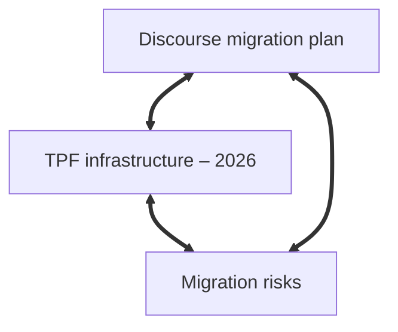

<svg width="397" viewBox="0 0 397 512" fill="none" xmlns="http://www.w3.org/2000/svg" style="margin-top: 25px; max-width: 90%;">
<path d="M324.709 475.437C321.564 498.795 298.704 517.043 275.987 510.743C243.618 501.826 206.139 487.918 172.416 485.326C167.97 484.984 120.732 481.403 120.732 481.403C112.376 480.808 104.533 477.157 98.6965 471.148L9.63858 379.448C-0.0941202 369.428 -2.72861 354.484 2.99039 341.74C2.99039 341.74 58.0589 220.728 60.1042 214.435C62.1495 208.142 69.6555 153.256 74.1035 123.77C75.2825 115.956 79.1405 108.793 85.0165 103.508L190.369 8.74822C205.027 -4.43479 227.778 -2.4812 239.972 13.0074L328.473 125.419C333.48 131.781 336.047 139.688 336.084 147.783C336.185 169.08 337.943 212.805 349.719 240.968C361.175 268.361 382.2 297.946 393.189 312.504C397.405 318.091 398.052 325.646 394.489 331.673C386.734 344.801 371.412 370.009 349.719 402.351C334.764 424.651 327.834 452.218 324.709 475.437Z" fill="#6C31E3"/>
<path d="M108.293 478.079C149.651 394.115 148.498 333.963 130.899 291.034C114.702 251.53 84.578 226.613 60.834 211.149C60.334 213.383 59.609 215.564 58.67 217.658L2.98893 341.74C-2.73008 354.484 -0.0955851 369.428 9.63712 379.448L98.695 471.148C101.489 474.024 104.743 476.361 108.293 478.079Z" fill="url(#paint0_radial_1_115)"/>
<path d="M275.998 510.731C298.71 517.031 321.567 498.783 324.712 475.424C327.42 455.314 332.979 431.94 344.136 411.554C318.538 356.452 287.582 327.877 253.647 315.212C217.726 301.805 178.467 306.225 138.689 315.885C147.581 356.353 142.258 409.204 108.34 478.072C112.202 479.942 116.413 481.081 120.765 481.391C120.765 481.391 145.24 483.452 174.348 485.512C203.456 487.572 246.772 502.626 275.998 510.731Z" fill="url(#paint1_radial_1_115)"/>
<path d="M220.844 307.659C232.021 308.826 242.974 311.235 253.636 315.213C287.577 327.879 318.539 356.455 344.142 411.553C345.863 408.408 347.719 405.333 349.719 402.351C371.411 370.009 386.733 344.801 394.488 331.673C398.051 325.646 397.404 318.091 393.187 312.504C382.199 297.946 361.174 268.361 349.719 240.968C337.942 212.805 336.184 169.08 336.084 147.783C336.046 139.688 333.479 131.781 328.472 125.419L239.971 13.0073C239.498 12.4062 239.008 11.8256 238.504 11.2654C244.998 32.5466 244.558 49.6659 240.552 65.2287C236.838 79.6557 230.058 92.7451 222.897 106.571L222.896 106.573C220.493 111.21 218.049 115.93 215.662 120.812C206.161 140.247 197.582 162.241 196.317 191.734C195.051 221.228 201.097 258.22 220.847 307.658L220.844 307.659Z" fill="url(#paint2_radial_1_115)"/>
<path d="M220.832 307.658C201.084 258.221 195.035 221.228 196.301 191.733C197.567 162.238 206.146 140.244 215.649 120.807C218.036 115.924 220.481 111.204 222.884 106.566C230.044 92.7399 236.824 79.6517 240.537 65.226C244.544 49.6597 244.984 32.5357 238.484 11.2456C225.999 -2.61128 204.446 -3.91716 190.365 8.74822L85.0122 103.508C79.1362 108.793 75.2782 115.956 74.0992 123.77L61.2742 208.786C61.1552 209.575 61.0082 210.359 60.8342 211.138C84.5792 226.601 114.708 251.521 130.906 291.03C134.07 298.748 136.702 307.019 138.652 315.888C166.627 309.094 194.347 304.893 220.832 307.658Z" fill="url(#paint3_radial_1_115)"/>
<path fill-rule="evenodd" clip-rule="evenodd" d="M196.508 189.79C195.238 219.048 198.89 252.61 218.598 301.944L212.409 301.386C194.728 249.904 190.88 223.509 192.168 193.847C193.456 164.17 203.045 141.35 212.601 121.884C215.021 116.954 220.668 107.696 223.085 103.049C230.24 89.2908 235.002 82.0228 239.09 69.4468C244.804 51.8747 243.568 43.5519 242.917 35.2692C247.453 65.2105 230.234 91.2462 217.217 117.763C207.734 137.08 197.777 160.547 196.508 189.79Z" fill="url(#paint4_radial_1_115)"/>
<path fill-rule="evenodd" clip-rule="evenodd" d="M136.726 293.21C139.063 298.615 141.271 302.979 142.665 309.667L137.501 310.828C135.352 303.019 133.692 297.463 130.718 290.765C112.922 248.78 84.362 227.184 61.022 211.344C89.2138 226.511 118.149 250.251 136.726 293.21Z" fill="url(#paint5_radial_1_115)"/>
<path fill-rule="evenodd" clip-rule="evenodd" d="M142.965 314.949C152.827 360.838 141.826 419.137 109.406 475.807C136.504 419.644 149.641 365.703 138.7 315.864L142.965 314.949Z" fill="url(#paint6_radial_1_115)"/>
<path fill-rule="evenodd" clip-rule="evenodd" d="M254.86 310.821C308.014 330.713 328.48 374.389 343.778 410.822C324.885 372.671 298.618 330.538 252.953 314.9C218.207 303 188.862 304.411 138.697 315.796L137.579 310.821C190.819 298.691 218.655 297.272 254.86 310.821Z" fill="url(#paint7_radial_1_115)"/>
<defs>
<radialGradient id="paint0_radial_1_115" cx="0" cy="0" r="1" gradientUnits="userSpaceOnUse" gradientTransform="translate(103.845 469.791) rotate(-104.574) scale(232.965 155.247)">
<stop stop-color="white" stop-opacity="0.4"/>
<stop offset="1" stop-opacity="0.1"/>
</radialGradient>
<radialGradient id="paint1_radial_1_115" cx="0" cy="0" r="1" gradientTransform="matrix(-96.2576 -163.001 187.145 -110.545 277.685 511.988)" gradientUnits="userSpaceOnUse">
<stop stop-color="white" stop-opacity="0.3"/>
<stop offset="1" stop-opacity="0.25"/>
</radialGradient>
<radialGradient id="paint2_radial_1_115" cx="0" cy="0" r="1" gradientUnits="userSpaceOnUse" gradientTransform="translate(302.401 374) rotate(-82.4846) scale(382.284 282.434)">
<stop stop-color="white" stop-opacity="0.55"/>
<stop offset="1" stop-color="white" stop-opacity="0.05"/>
</radialGradient>
<radialGradient id="paint3_radial_1_115" cx="0" cy="0" r="1" gradientUnits="userSpaceOnUse" gradientTransform="translate(117.805 306.884) rotate(-77.7214) scale(326.45 222.631)">
<stop stop-color="white" stop-opacity="0.83"/>
<stop offset="1" stop-color="white" stop-opacity="0.4"/>
</radialGradient>
<radialGradient id="paint4_radial_1_115" cx="0" cy="0" r="1" gradientUnits="userSpaceOnUse" gradientTransform="translate(252.4 128) rotate(102.236) scale(169.859 114.542)">
<stop stop-color="white" stop-opacity="0"/>
<stop offset="1" stop-color="white" stop-opacity="0.17"/>
</radialGradient>
<radialGradient id="paint5_radial_1_115" cx="0" cy="0" r="1" gradientUnits="userSpaceOnUse" gradientTransform="translate(53.399 220) rotate(45.3237) scale(125.16 266.579)">
<stop stop-color="white" stop-opacity="0.2"/>
<stop offset="1" stop-color="white" stop-opacity="0.44"/>
</radialGradient>
<radialGradient id="paint6_radial_1_115" cx="0" cy="0" r="1" gradientUnits="userSpaceOnUse" gradientTransform="translate(147.891 279.224) rotate(80.2016) scale(146.696 311.515)">
<stop stop-color="white" stop-opacity="0.25"/>
<stop offset="1" stop-color="white" stop-opacity="0.3"/>
</radialGradient>
<radialGradient id="paint7_radial_1_115" cx="0" cy="0" r="1" gradientUnits="userSpaceOnUse" gradientTransform="translate(342.401 398.999) rotate(-152.297) scale(223.528 703.43)">
<stop stop-color="white" stop-opacity="0.21"/>
<stop offset="0.46738" stop-color="white" stop-opacity="0.19"/>
<stop offset="1" stop-color="white" stop-opacity="0.29"/>
</radialGradient>
</defs>
</svg>

To function in life, I need notes. For writing, research, coding, to-do lists, travel, and everyday life: if I don’t write it down, it's gone.

For years I kept my notes in a single directory of Markdown files, edited entirely in VS Code. It was functional, but there was a problem: it couldn’t keep pace with my thinking. My ideas evolved, ramified, and recombined, while the notes remained static. Even though I made the filenames descriptive (`tpf-migration-master-note.md`, `tpf-archive-deployment-process.md`), there was no organization. Notes related to each other only in my head, if at all, and nothing external to my mind supported the connective work of actual thinking: relating ideas, returning to undeveloped ones, and bringing out latent patterns.

What I had was a ***collection***, in the systems-theory sense: a container for items that sit alongside each other without interacting. Collections just aggregate. They gather items together, but they don't have any internal ordering principles, because nothing in the structure tells you how one item relates to another. So while my notes could potentially have informed one another, just like thoughts, my setup provided no mechanism for this.

What I needed was not a collection but a ***system***.

## 1. A setup without structure

My old way had some advantages over cloud-hosted, database-driven applications like Evernote, Google Keep, and Notion:

- _Simple:_ all the notes were plain text files written in Markdown, edited in the same tool I use for writing and coding (VS Code), and contained in a single directory with no internal hierarchy.
- _Backed up:_ changes were pushed to GitHub regularly.
- _Resilient:_ plain text will outlive editors, publishing platforms, and storage environments.
- _Fast:_ opening or editing files was quick.
- _Local:_ all notes were on my machine, not in the cloud.

But it had inherent limits:

### No links

The lack of any explicit connection between notes meant that I had to remember the relationships myself. You might say this is good for the brain, that we shouldn't be relying on technology for everything, but this is unrealistic. Modern life demands more than a humble brain can deal with on its own. It can do its best work when complemented by external tools, and a flat directory is not much of a tool, because it encourages a linear, archival mode of thinking, rather than a dynamic, relational one. Or else, it's just a searchable dump. It's a truism that ideas disappear unless they're actively recalled, and in my old flat-folder setup there was never an occasion for recalling an old idea, since they had effectively become abandoned orphans.

### No structure beyond filenames

Hyphens in filenames: that was my architecture, a way of imposing structure on chaos. But this is like naming rooms on a floorplan before any walls have been built---and _without knowing how the building is going to be used_. Names are important, but they can only encode so much information; what's missing is context. Systems theorists would say the structure was _external_ to the notes, not _emergent_ from them. 

But why is an emergent structure better than an imposed, external one? Because it expresses the dynamics of the system. It's about change. The paradigm shift is to go from thinking in terms of classification to thinking in terms of always-evolving relationships. Order is only useful when it grows out of relationships, so that the structure can evolve with the content rather being cut off, trapped at an earlier stage of thought.

### No system for evolving notes

One note would get buried under new ones, and then entropy would take hold, resulting in a growing pile of knowledge-units that were largely inaccessible, stripped of context, or no longer able to do any cognitive work. While my thinking evolved, the notes themselves, and what structure they had, were left behind to decay. There was no mechanism for self-updating, no feedback loop, and no recursivity.

## 2. Why Obsidian?

All of the above is hindsight. I didn't know there was a problem. Everything was _fine_. Then, one day, I noticed Obsidian mentioned online somewhere, as a tool for writers, so I decided to try it. 

I quickly found that Obsidian had all the advantages of my old setup---plain text Markdown, speed, resilience, local-first storage---while adding the one thing the flat model couldn't give me, namely a flexible structure for ideas to form patterns, clusters, and trajectories over time.

The game-changing feature is links.

### Two-way linking

Pretty much all the advantages of Obsidian grow from this feature, but it's so incredibly simple. Linking `[[like this]]` inside notes creates explicit relationships, allowing you to quickly navigate around your knowledge network, as if navigating around your own mind. A real-world example is my project to migrate [thephilosophyforum.com](https://thephilosophyforum.com) (TPF) to the Discourse platform, for which I'm using notes like these:

#### Note 1: Discourse migration plan

```
# Discourse migration plan

- Set up staging server  
- Export user data  
- Validate posts  

Related:
- [[TPF infrastructure – 2026]]
- [[Compliance checklist – migration]]
- [[Migration risks]]
```

#### Note 2: TPF infrastructure – 2026

```
# TPF infrastructure – 2026

- Server locations  
- Backup routines  
- Dependencies  

Related:
- [[Migration risks]]

Linked mentions:
- [[Discourse migration plan]]
```

The first note links to `TPF infrastructure – 2026`, and within the latter note Obsidian automatically inserts a link back to the first, under `Linked mentions`. So you get a two-way link:

```
[Discourse migration plan] <==> [TPF infrastructure – 2026]
```

My initial reaction to this was a mental shrug: “Is that it?” But the simplicity is precisely the point. Two notes, linked in both directions and easily navigable in Obsidian, form a relationship which is no longer just abstract, but is actually usable. And when a third is added, a pattern begins to form, an emergent bottom-up architecture.


*A fully connected cluster in Obsidian*

What makes this so powerful is the reciprocity. With links and backlinks combined, notes can see each other, and they stop being mere items in some higher-level list.

Incidentally, the diagram above was generated directly inside Obsidian using its built-in [Mermaid](https://mermaid.js.org/) integration. I typed this:

~~~
# Node cluster


~~~

... and Obsidian rendered it instantly within the note itself.

### Relations, not containers

It's possible to use Obsidian with a directory structure---flexibility is key to its success, after all---but the real structure comes from the links. In systems-theory terms, directories are static containers, while links constitute dynamic relations. Because Obsidian doesn’t impose a hierarchy, structure can emerge naturally from these relations.

### Emergent structure

With more and more links in your Obsidian vault, some notes organically become Maps of Content (MOCs), which are hubs that emerge and evolve, gathering related ideas together as the network develops. An MOC represents a an idea or project in flux, rather than mapping out a plan. As we should all know by now, very often [planning is guessing](https://world.hey.com/jmcascalheira/planning-is-guessing-29826682).

Rather than a plan, the bottom-up organization of an MOC is an organic part of the structure; it arises from relations. And even if you do _begin_ with an MOC (as I did myself), rather than allowing one to develop later, the purely link-based method of organization means it can evolve according to the connections you create over time. Its structure is provisional and responsive to new connections. 

### Templates

A nice little productivity feature, you might think. A way of avoiding repetitive typing, rather like text expanders and clipboard managers. But Obsidian templates are more than that: they’re structural. A template is a basic shape for a unit of knowledge, a reusable pattern which offers some structure, *but not too much*: unlike the content structures imposed by most note-taking apps, the template doesn’t dictate how the note develops.

To make this concrete: Evernote and OneNote impose, or at the very least _encourage_, notes which start with a **Title → Body → Checklist → Attachment** pipeline pattern, and their whole interface builds on this structure. A note that doesn’t fit thus feels wrong in this context, which effectively forces you to adapt your thinking to the app. Of course, what we really want is for the app to adapt to our thinking, and to help guide it where needed.

And that's exactly what Obsidian templates do. There are no required fields, and they don’t impose any categories. They just give you a starting point and the rest of the note can branch, diverge, merge, or transform according to the movement of the idea itself. The template follows the thought, not the other way around.

#### Templates as mimetic forms

Conceptually, this is a lot like Theodor Adorno’s account of _mimesis_. For Adorno, genuine knowledge requires a kind of humility, an adaptation to the object rather than an imposition of conceptual categories. But the key is not to abandon concepts entirely, as in magical or animistic mimesis, but to be responsive, letting the object push back against the categories you want to impose.

Templates in Obsidian work mimetically in this Adornian sense: they offer a lightweight conceptual shape, but one that remains open to being _re_-shaped by the idea itself. The template adapts to the note, and vice versa.


#### Schemas vs. patterns

There's a distinction in systems theory between _schemas_ and _patterns_. Schemas are fixed and enforced, while patterns are adaptable and emergent. Many note-taking tools force or encourage you to use schemas, with their pre-defined fields and metadata. Obsidian templates work differently. They essentially create a loose initial condition by seeding the note with a _pattern_. The key is that after this point the structure can change in accordance with the connections that develop along the way.


## 3. The migration

Moving to Obsidian was pretty painless. Here is how I approached it:

### Step 1: Open the directory as a vault

My flat folder of Markdown files became an Obsidian “vault,” but it didn't require any export/import, conversions, data entry or manual processing. The folder remained exactly as it was---Obsidian simply recognized it as a vault. In systems-theoretic terms, without any transformation or duplication, my `Notes` directory became the boundary of a new system, i.e., the field within which relationships could begin to form and evolve.

### Step 2: Start linking

This was the conceptual breakthrough. Having read some online introductory guides, I dutifully began linking, while thinking about how to connect up my ideas and projects. That small but crucial phase of the process---linking while thinking---became the pattern. Whenever one note invoked an idea that lived in another, I connected them. Nothing planned, and nothing consciously systematic. Just a habit, formed at the point of use, which became the mechanism for building a knowledge architecture.


### Step 3: Create a "Home master" note

In case you think my system is too soft and fuzzy, a hippie commune where every note has equal status, you can introduce hierarchy when you need it, and in fact, hierarchy tends to emerge anyway, as exemplified by MOCs. Not all nodes (i.e., notes) are necessarily equal. My `[Home master]` note, effectively an MOC, functions like a central node:

```
## Projects
- [[Discourse migration plan]]
- [[TPF archive website]]
- [[TPF moderation guidelines – draft]]
- [[Relocation and residency – planning]]
- [[Obsidian workflow refinement]]

## Writing
- [[Commentary on Plato's Republic]]
- [[Notes on Adorno’s Negative Dialectics]]
- [[Article ideas – technical writing]]
- [[Short stories – drafts]]
- [[Obsidian knowledge architecture – article]]

## Ideas
- [[Constellations vs. taxonomies]]
- [[Adornian knowledge architecture]]
- [[Identity Thinking as Hierarchical Trees]]
- [[Mimesis and conceptual form]]
- [[Against the separation of facts and values]]

## Reading
- [[Negative Dialectics reading group]]
- [[Plato – Republic study notes]]
- [[Critical theory overview – working note]]

## Career
- [[Job application scratch pad]]
- [[Career materials – templates and drafts]]
- [[Jobs applied for]]
- [[Calendly scheduling]]

## Workflows
- [[Daily note pattern]]
- [[Project template]]
- [[Idea note template]]
- [[Research workflow]]
- [[TPF admin workflow]]

## Admin
- [[Finance and budgeting master]]
- [[Scotland January 2026]]
```

It has a certain authority, but it's not set in stone, and it's entirely up to me how to use it or change it. It's really just an easy way in to the system: under the headings I have links to other master notes and MOCs, but also to ordinary notes, some of which are ephemeral, and some permanent.

### Step 4: Start using natural language filenames

I resisted this at first, but now I'm on board. Obsidian makes it easy, and it's undeniably true that note names are more readable without the hyphens. Whereas before I had a jumble of files such as `discourse-info-todo-list.md`, now I have `Discourse migration plan` and so on.

Under the hood, the notes are really no more than files, but Obsidian makes it easy to think of them more productively, as units of knowledge.

However---and this is important---I did not have to write a script to rename all my Markdown files, or even worse, rename them manually. Instead, I trust in the system, renaming notes as I come to them. At some point it should be possible to purge whatever is left.

### Step 5: Introduce templates

Here is my `Idea` template:

```
# {{title}}

{{date}}

## Overview

## Related to

## Questions

## Developments

## Opposition

## Source

```

Nothing fancy. Basically just some headings. But once again, the power of the system is in its low-level simplicity. In this case, the headings reflect the rhythm of ideas:

- *Overview:* the high-level orientation.  
- *Related to:* a list of Obsidian links to reflect the immediate context that gives the idea its shape.
- *Questions:* problems, unresolved issues, and possibilities. 
- *Developments:* seeing where the idea wants to go next.  
- *Opposition:* which ideas are opposed to this one. Again these could be links to other notes. 
- *Source:* where the idea came from. An external link or a citation.

This is just enough structure to allow an idea to take shape while staying flexible.

Recall the problem of lack of recall that I mentioned earlier. Well templates help to solve it. With the use of templates, returning to an old note becomes like recalling a memory, because notes created with the same template share a transparent structure. If you know the feeling of opening an abandoned file and asking yourself, "What on Earth did I mean by that?", then you'll love this.

## 4. How Obsidian changed my workflow

Two changes happened right away:

### Notes became interconnected

Instead of writing standalone documents, I now build clusters of meaning. That may sound a bit pretentious, but it’s what actually happens when notes start relating to each other. Each link adds context, each backlink traces a line in thought, and each cluster gives shape to some domain of knowledge or activity.

Interconnection also changes how I work. When I start writing about a topic, related notes begin to build up, e.g., definitions I wrote months ago or fragments of arguments. Some are backlinks---notes I previously linked to this topic, appearing in a note under `Linked mentions`---and others appear under `Unlinked mentions`, where Obsidian detects similar phrases in older notes. The network brings these together without my having to remember them. 

### Recall was increasingly reinforced

Not only templates but also backlinks help bring old notes back to life. This combination is a powerful extension of memory. Backlinks reveal older notes at the moment they become relevant. When you open a note in Obsidian, the backlink pane immediately shows every note that points to it, creating a set of entry points leading to old ideas; and old ideas are not necessarily _bad_ ideas. Ideas you would otherwise have forgotten reappear precisely when they matter. Over time, clusters of backlinks make latent patterns visible---themes, things missing, ongoing concerns---which naturally invite you to re-enter and pick up those lines of thought once again.


## 5. Lessons learned

This is what I’d tell anyone starting out with Obsidian:

1. _Start with links:_ structure that grows out of relations is more sustainable than an order imposed by decree.
2. _Don’t rely too heavily on tags:_ tags classify, whereas links contextualize. Only the latter systemically enables insight.
3. _Allow the system to evolve:_ your vault is a living environment.
4. _Templates provide rhythm:_ they reduce friction and preserve coherence without becoming dogmatic.
5. _Keep everything local-first:_ Obsidian’s philosophy aligns with a fundamental principle: the more you understand and directly control the matrix of your knowledge system, the more that system belongs to you.


## Conclusion

In cognitive science and the philosophy of mind, the “extended mind” thesis holds that the tools we use can become part of our thinking apparatus (otherwise known as the mind) when our interactions with them are reliable, habitual, and integrated. What I found in moving to Obsidian was something like that: when my folder became a vault, it stopped being a repository and became part of my cognitive toolkit. The structure of the vault began to shape the structure of my thought, and my thought in turn reshaped the vault.

I don't think it's a grandiose exaggeration to say that in Obsidian, my notes became an extension of my mind, in an unashamedly literal sense.

## Links

- [Obsidian home page](https://obsidian.md/)  
- [Tim Miller, "Getting Started with Obsidian Notes: A Beginner’s Guide"](https://obsidian.rocks/getting-started-with-obsidian-a-beginners-guide/)
- [Tim Miller, "Maps of Content"](https://obsidian.rocks/maps-of-content-effortless-organization-for-notes/)
- [Gordon Brander, "All You Need is Links"](https://newsletter.squishy.computer/p/all-you-need-is-links)  
- [Andy Clark & David J. Chalmers, "The Extended Mind"](https://consc.net/papers/extended.html)