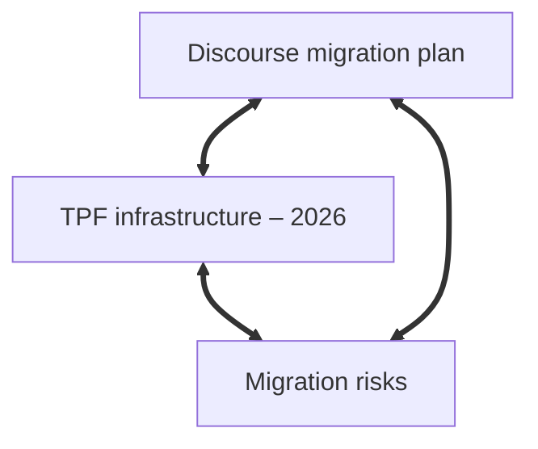

For years I kept my notes in a single directory of Markdown files, edited entirely in VS Code. It was functional, but there was a problem: it couldn’t keep pace with my thinking. My ideas evolved, ramified, and recombined, while the notes remained static. Even though I made the filenames descriptive (`tpf-migration-master-note.md`, `tpf-archive-deployment-process.md`), there was no organization. Notes related to each other only in my head, if at all, and nothing external to my mind supported the connective work of actual thinking: relating ideas, returning to undeveloped ones, and bringing out latent patterns.

What I had was a ***collection***, in the systems-theory sense: a container for items that sit alongside each other without interacting. Collections just aggregate. They gather items together, but they don't have any internal ordering principles, because nothing in the structure tells you how one item relates to another. So while my notes could potentially have informed one another, just like my thoughts did, my setup provided no mechanism for this.

What I needed was not a collection but a ***system***.

## 1. A setup without structure

My old way had some advantages over cloud-hosted, database-driven applications like Evernote, Google Keep, and Notion:

- **Simple:** all the notes were plain text files written in Markdown, edited in the same tool I use for writing and coding (VS Code), and contained in a single directory with no internal hierarchy.
- **Backed up:** changes were pushed to GitHub regularly.
- **Resilient:** plain text will outlive editors, publishing platforms, and storage environments.
- **Fast:** opening or editing files was quick.
- **Local:** all notes were on my machine, not in the cloud.

But it had inherent limits:

### No links

The lack of any explicit connection between notes meant that I had to remember the relationships myself. You might say this is good for the brain, that we shouldn't be relying on technology for everything, but this is unrealistic. Modern life demands more than a humble brain can deal with on its own. It can do its best work when complemented by external tools, and a flat directory is not much of a tool, because it encourages a linear, archival mode of thinking, rather than a dynamic, relational one. Or else, it's just a searchable dump. It's a truism that ideas disappear unless they're actively recalled, and in my old flat-folder setup there was never an occasion for recalling an old idea, since they had effectively become abandoned orphans.

### No structure beyond filenames

Hyphens in filenames: that was my architecture, a way of imposing structure on chaos. This is like naming rooms on a floorplan before any walls have been built, _without knowing how the building is going to be used_. Names can only encode so much information; the crucial thing missing is context. Systems theorists would say the structure was external to the notes, not emergent from them. 

But why is an emergent structure better than an imposed one? Because it expresses the internal dynamics of the system. It's about change. The paradigm shift is to go from thinking in terms of classification to thinking in terms of always-evolving relationships. Order is only useful when it grows out of relationships, so that the structure can evolve with the content rather being cut off, trapped at an earlier stage of thought.

### No system for evolving notes

One note would get buried under new ones, and then entropy would take hold, resulting in a growing pile of knowledge-units that were largely inaccessible, stripped of context, or no longer able to do any cognitive work. While my thinking evolved, the notes themselves, and what structure they had, were left behind to decay. There was no mechanism for self-updating, no feedback loop, and no recursivity.

## 2. Why Obsidian?

That's when I found Obsidian. Obsidian has all the advantages of my old setup---plain text Markdown, speed, resilience, local-first storage---while adding the one thing the flat model couldn't provide, namely a flexible structure in which ideas could form patterns, clusters, and trajectories over time.

The key feature is links.

### Two-way linking

This is the core feature from which all other advantages of Obsidian grow. Linking `[[like this]]` inside notes creates explicit relationships, allowing you to quickly navigate around your knowledge network, as if navigating around your own mind. A real-world example is my project to migrate [thephilosophyforum.com](https://thephilosophyforum.com) (TPF) to the Discourse platform, for which I'm using notes like these:

#### Note 1: Discourse migration plan

```md
# Discourse migration plan

- Set up staging server  
- Export user data  
- Validate posts  

Related:
- [[TPF infrastructure – 2026]]
- [[Compliance checklist – migration]]
- [[Migration risks]]
```

#### Note 2: TPF infrastructure – 2026

```md
# TPF infrastructure – 2026

- Server locations  
- Backup routines  
- Dependencies  

Related:
- [[Migration risks]]

Linked mentions:
- [[Discourse migration plan]]
```

The first note links to `TPF infrastructure – 2026`, and within the latter note Obsidian automatically inserts a link back to the first, under `Linked mentions`. So you get a two-way link:

```
[Discourse migration plan] <==> [TPF infrastructure – 2026]
```

My first reaction to this was, “Is that it?” It seemed too simple. But of course, the simplicity is precisely the point. Two notes, linked in both directions and easily navigable in Obsidian, form a relationship. When a third is added, a pattern begins to form, an emergent bottom-up architecture.


*A fully connected cluster in Obsidian*

The power of these links is reciprocity. Backlinks make notes visible to each other, so they stop being mere items in some higher-level list and start forming a conceptual system.

Incidentally, the diagram above was generated directly inside Obsidian using its built-in [Mermaid](https://mermaid.js.org/) integration. I typed this:

~~~
# Node cluster


~~~

... and Obsidian rendered it instantly within the note itself.

### Relations, not containers

It's possible to use Obsidian with a directory structure---flexibility is key to its success, after all---but the real structure comes from the links. In systems-theory terms, directories are static containers, while links constitute dynamic relations. Because Obsidian doesn’t impose a hierarchy, structure can emerge naturally from these relations.

### Emergent structure

With more and more links in your Obsidian vault, some notes organically become Maps of Content (MOCs), hubs which emerge and evolve, gathering related ideas together as the network develops. An MOC reflects how the system currently understands a theme, rather than a prior plan---very often, [planning is guessing](https://world.hey.com/jmcascalheira/planning-is-guessing-29826682). Rather than a plan, the bottom-up organization of MOCs is an organic part of the structure that arises from relations. And even if you _begin_ with an MOC rather than allowing one to develop---as I did myself---the solely link-based method of organization means it will still evolve according to the connections you create over time. Its structure is always provisional, always responsive to new connections. 

### Templates

A nice little productivity feature, you might think. A way of avoiding repetitive typing, rather like text expanders and clipboard managers. But Obsidian templates are more than that: they’re structural. A template is a basic shape for a unit of knowledge, a reusable pattern which offers some structure, *but not too much*: unlike the content structures imposed by most note-taking apps, the template doesn’t dictate how the note develops.

For example, Evernote and OneNote impose or encourage notes that start with a **Title → Body → Checklist → Attachment** pattern, and their whole interface presumes the presence of this structure. A note that doesn’t fit the template therefore feels "wrong" in this context, which effectively forces you to adapt your thinking to the app. Of course, what we really want is for the app to adapt to our thinking, and to help guide it where needed.

Enter Obsidian templates. There are no required fields, and they don’t enforce any categories. They simply give you a starting point and the rest of the note can branch, diverge, merge, or transform according to the movement of the idea itself. The template follows the thought, not the other way around.

#### Templates as Mimetic Forms

Conceptually, this is a lot like Theodor Adorno’s account of _mimesis_. For Adorno, genuine knowledge requires a kind of humility, an adaptation to the object rather than an imposition of conceptual categories. But the key is not to abandon concepts entirely, as in magical or animistic mimesis, but to be responsive, letting the object push back against the categories you want to impose.

Templates in Obsidian work mimetically in this Adornian sense: they offer a lightweight conceptual shape, but one that remains open to being _re_-shaped by the idea itself. The template adapts to the note, and vice versa.


#### Schemas vs. Patterns

There is a distinction in systems theory between _schemas_ and _patterns_. Schemas are fixed and enforced, while patterns are adaptable and emergent. Many note-taking tools force or encourage you to use schemas, with their pre-defined fields and metadata. Obsidian templates work differently. They essentially create a loose initial condition by seeding the note with a _pattern_. The key is that after this point the structure can change in accordance with the connections that develop along the way.


## 3. The migration

Moving to Obsidian was pretty painless. Here is how I approached it:

### Step 1: Open the directory as a vault

My flat folder of Markdown files became an Obsidian “vault,” but it didn't require any export/import, conversions, data entry or manual processing. The folder remained exactly as it was---Obsidian simply recognized it as a vault. In systems-theoretic terms, my `Notes` directory became the boundary of a new system, i.e., the field within which relationships could begin to form and evolve.

### Step 2: Start linking, not renaming

This was my conceptual breakthrough. In the flat-folder approach, I tried to squeeze meaning into the filename itself, as if the right naming scheme could compensate for the lack of a system. 

I had tried using tags, hoping that a layer of classification would make up for the lack of a structure. But tags just label categories, and categories are no more than collections. So even with the classification, what I had was still just a collection, one which contained other collections.

Much better than a taxonomy is to have a network in which relationships become as important as the nodes themselves. Once I began creating links, a web of connections appeared that my old setup had kept invisible.

### Step 3: Create a "home master" note

In case you think my system is too soft and fuzzy, a hippie commune where every note has equal status, you can introduce hierarchy when you need it, and in fact, hierarchy tends to emerge anyway, as exemplified by MOCs. Not all nodes (i.e., notes) are necessarily equal. My `[Home master]` note, effectively an MOC, functions like a central node:

```
## Projects
- [[Discourse migration plan]]
- [[TPF archive website]]
- [[TPF moderation guidelines – draft]]
- [[Relocation and residency – planning]]
- [[Obsidian workflow refinement]]

## Writing
- [[Commentary on Plato's Republic]]
- [[Notes on Adorno’s Negative Dialectics]]
- [[Article ideas – technical writing]]
- [[Short stories – drafts]]
- [[Obsidian knowledge architecture – article]]

## Ideas
- [[Constellations vs. taxonomies]]
- [[Adornian knowledge architecture]]
- [[Identity Thinking as Hierarchical Trees]]
- [[Mimesis and conceptual form]]
- [[Against the separation of facts and values]]

## Reading
- [[Negative Dialectics reading group]]
- [[Plato – Republic study notes]]
- [[Critical theory overview – working note]]

## Career
- [[Job application scratch pad]]
- [[Career materials – templates and drafts]]
- [[Jobs applied for]]
- [[Calendly scheduling]]

## Workflows
- [[Daily note pattern]]
- [[Project template]]
- [[Idea note template]]
- [[Research workflow]]
- [[TPF admin workflow]]

## Admin
- [[Finance and budgeting master]]
- [[Scotland January 2026]]
```

It has a certain authority, but it's not set in stone, and it's entirely up to me. It's really just an easy way in to the system: under the heading I have links to other master notes and MOCs, but also to ordinary notes, some of which are ephemeral, and some permanent.

### Step 4: Start using natural language filenames

I resisted this at first, but now I'm on board. Obsidian makes it easy, and it's undeniably true that note names are more readable without the hyphens. Whereas before I had a jumble of files such as `discourse-info-todo-list.md`, now I have `Discourse migration plan` and so on.

Under the hood, the notes are really no more than files, but Obsidian makes it easy to think of them more productively, as units of knowledge.

However---and this is important---I did not have to write a script to rename all my Markdown files, or even worse, rename them manually. Instead, I trust in the system, renaming notes as I come to them. At some point it should be possible to purge whatever is left.

### Step 5: Introduce templates

Here is my `Idea` template:

```md
# {Idea name}

{{date}}

## Overview

## Related to

## Questions

## Developments

## Opposition

## Source

```

Nothing fancy. Basically just some headings. But once again, the power of the system is in its low-level simplicity. In this case, the headings reflect the rhythm of ideas:

- *Overview:* the high-level orientation.  
- *Related to:* a list of Obsidian links to reflect the immediate context that gives the idea its shape.
- *Questions:* problems, unresolved issues, and possibilities. 
- *Developments:* seeing where the idea wants to go next.  
- *Opposition:* which ideas are opposed to this one. Again these could be links to other notes. 
- *Source:* where the idea came from. An external link or a citation.

This is just enough structure to allow an idea to take shape while staying flexible.

Templates help to maintain continuity too, solving the problem of lack of recall that I mentioned earlier. With the use of templates, returning to an old note becomes like recalling a memory, because notes created with the same template share a transparent structure. If you know the feeling of opening an abandoned file and asking yourself, "What on Earth did I mean by that?", then you'll love this. The system supports _recall_, one of the things that was missing in my old setup.

## 4. How obsidian changed my workflow

Three changes happened right away:

### Notes became interconnected

Instead of writing documents, I can now build clusters of meaning. A concept gains depth as links accumulate, forming constellations (to use the analogy developed by Walter Benjamin and Adorno) rather than silos.

### The system encourages revisiting

Backlinks reveal forgotten relationships. They produce a mild form of self-recursion: notes call attention to themselves when they become relevant again.

### Writing projects are “live” objects

Where I once had a single master note and a scattering of files, now each project becomes:

- A node  
- A context  
- A collection of dependencies  
- A workflow space  

This approach mirrors the idea of systems evolving through internal differentiation, rather than central planning.


## 5. Lessons learned

This is what I’d tell anyone migrating from flat Markdown to Obsidian:

1. _Start with links:_ structure that grows out of relations is more sustainable than an order imposed by decree.
2. _Don’t rely too heavily on tags:_ tags classify, whereas links contextualize. Only the latter systemically enables insight.
3. _Allow the system to evolve:_ your vault is a living environment.
4. _Templates provide rhythm:_ they reduce friction and preserve coherence without becoming dogmatic.
5. _Keep everything local-first:_ Obsidian’s philosophy aligns with a fundamental principle: the more you understand and directly control the matrix of your knowledge system, the more that system belongs to you.


## Conclusion

In cognitive science and the philosophy of mind, the “extended mind” thesis holds that the tools we use can become part of our thinking apparatus (otherwise known as the mind) when our interactions with them are reliable, habitual, and integrated. What I found in moving to Obsidian was something like that: when my folder became a vault, it stopped being a repository and became part of my cognitive toolkit. The structure of the vault began to shape the structure of my thought, and my thought in turn reshaped the vault.

I had really just been looking for a cool new productivity tool, but what I got was a thinking environment, something flexible enough to evolve frictionlessly with my projects, my writing, and my research.


## Links

- [Obsidian home page](https://obsidian.md/)  
- [Tim Miller, "Getting Started with Obsidian Notes: A Beginner’s Guide"](https://obsidian.rocks/getting-started-with-obsidian-a-beginners-guide/)
- [Tim Miller, "Maps of Content"](https://obsidian.rocks/maps-of-content-effortless-organization-for-notes/)
- [Gordon Brander, "All You Need is Links"](https://newsletter.squishy.computer/p/all-you-need-is-links)  
- [Andy Clark & David J. Chalmers, "The Extended Mind"](https://consc.net/papers/extended.html)
